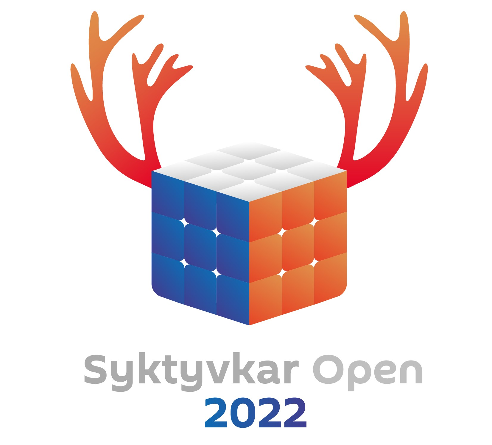

В ходе реализации этого проекта мною были организованы соревнования по спидкубингу **Syktyvkar Open 2022**. Их результаты были признаны [Федерацией Спидкубинга](https://cubingrf.org). С результатами можно ознакомиться [здесь](https://funcubing.org/competitions/SyktyvkarOpen2022).

